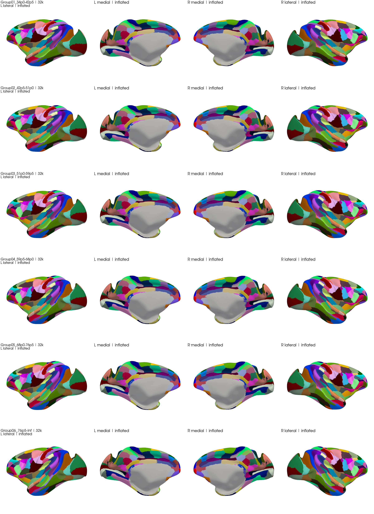
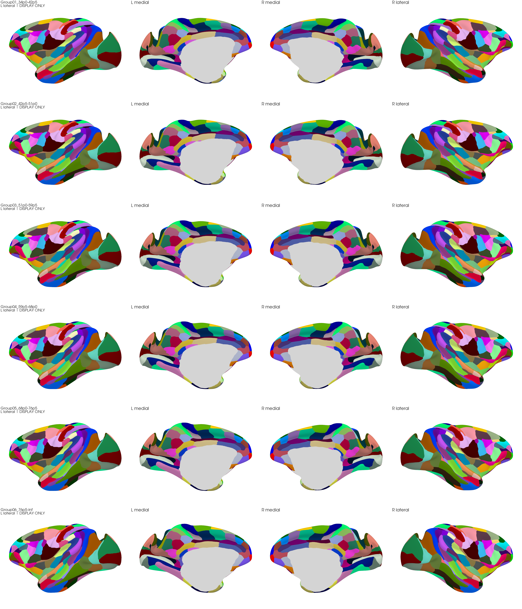

# Macaque Age-Template Brainnetome Atlas

**v4 preview** · Six macaque age-template cortical atlases · [中文说明](README_中文.md)

This project maps the adult Macaque Brainnetome cortical definitions onto six age-template anatomies. The primary package contains matched 32k surfaces and 248-label volumes in each original 0.5-mm template grid. A separate cosmetic package is provided **only for illustration**.

**Anatomical validation remains HOLD.** File integrity, complete label counts and cosmetic continuity do not establish anatomical correctness. The display-only labels must never be used for ROI extraction, morphometry, connectivity, registration or statistical analysis.

## Download

| Package | Intended use | Download |
|---|---|---|
| Primary v4 atlas | Existing atlas labels with documented reconstruction/QC limitations | [macaque_age_atlas_v4_minimal.zip](https://github.com/wenlii/Macaque-development-Brainnetome-Atlas/releases/download/v4-preview/macaque_age_atlas_v4_minimal.zip) |
| Cosmetic display companion | **DISPLAY ONLY — no downstream computation** | [macaque_age_atlas_v4_display_only.zip](https://github.com/wenlii/Macaque-development-Brainnetome-Atlas/releases/download/v4-preview/macaque_age_atlas_v4_display_only.zip) |
| Checksums | Verify ZIP integrity | [SHA256SUMS.txt](https://github.com/wenlii/Macaque-development-Brainnetome-Atlas/releases/download/v4-preview/SHA256SUMS.txt) |
| Release manifest | Source versions, hashes and scope | [release_manifest.json](https://github.com/wenlii/Macaque-development-Brainnetome-Atlas/releases/download/v4-preview/release_manifest.json) |

Use the attached ZIP assets on the [v4 release page](https://github.com/wenlii/Macaque-development-Brainnetome-Atlas/releases/tag/v4-preview). GitHub's automatically generated **Source code** archives are not the atlas data packages. The primary and display-only ZIPs contain different labels and must not be mixed.

## Quick start

1. Download the appropriate ZIP and `SHA256SUMS.txt`, then verify the archive hash.
2. Extract the whole package, keeping its folder structure.
3. For the primary atlas, open `groups/<group>/atlas.wb.spec` in Connectome Workbench.
4. For the cosmetic companion, open `groups/<group>/DISPLAY_ONLY_dense.wb.spec`.

The analysis package can be checked with `python validate_release.py` from its extracted root after installing `requirements.txt`. The display package contains its own checking and rendering scripts. See [usage](docs/USAGE.md) and [code/input requirements](code/README.md).

## Primary atlas

Each hemisphere has 32,492 vertices and 124 labels. The combined volume uses IDs 1–124 for the left hemisphere and 125–248 for the right. All six primary volumes contain all 248 labels. Group06 right CG.RSr is present in 8 voxels and remains sensitive to sampling choices.

The [age-group table](metadata/age_groups.tsv) gives bin definitions, observed ages and scan/animal counts. Group06 actually spans 79–98 months with 7 scans from 3 male animals. Repeated scans and overlapping animals across bins mean template measurements are not independent individual observations. The labels retain adult ROI definitions rather than independently estimating age-dependent parcellation boundaries.

The v4 refinement added 335 native and 101 32k support vertices under adult-label, age-GM and geometric constraints. Mild categorical voting and protected source-component handling were followed by native ribbon projection. See [methods and known limitations](docs/METHODS_AND_LIMITATIONS.md), [group QC](metadata/analysis_group_qc.tsv), [ROI QC](metadata/analysis_roi_qc.tsv) and [v4 changes](metadata/v4_vs_v3_summary.tsv).

## Separate cosmetic companion

This companion intentionally fills remaining gray holes and smooths apparent boundaries, including locations excluded by scientific geometry QC. Its dense presentation mesh is interpolated from 32k and adds no MRI information. All files and figures are marked `DISPLAY_ONLY`. See [the distinction](docs/DISPLAY_ONLY.md) and [Group04 before/after](figures/Group04_comparison_DISPLAY_ONLY.png).

## Citation and license

**Author:** Wen Li · Institute of Automation, Chinese Academy of Sciences. Use [CITATION.cff](CITATION.cff) for this version and cite the adult source: Lu et al., *Macaque Brainnetome Atlas: A multifaceted brain map with parcellation, connection, and histology*, Science Bulletin (2024), [doi:10.1016/j.scib.2024.03.031](https://doi.org/10.1016/j.scib.2024.03.031).

[LICENSE.md](LICENSE.md) preserves the project's existing CC-BY-4.0 notice and its distinction between the article license and upstream data-use terms. This release introduces no new licensing determination. Full native reconstructions, raw subject data and historical work directories are not part of these minimal assets. Existing repository files outside the documented release inputs are not used by the atlas pipeline.
